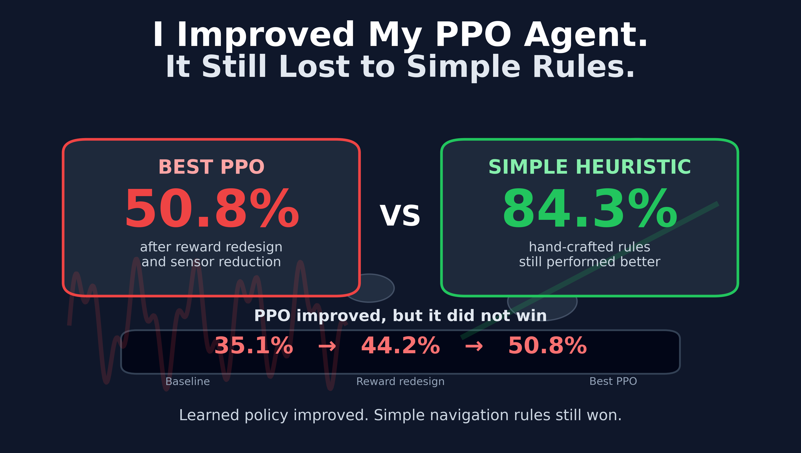
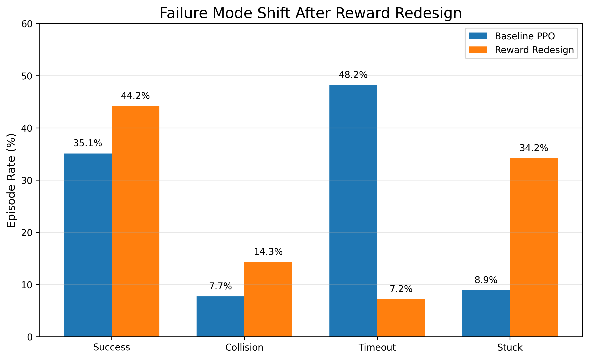
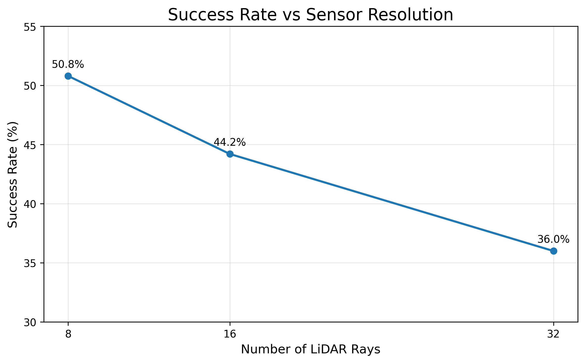
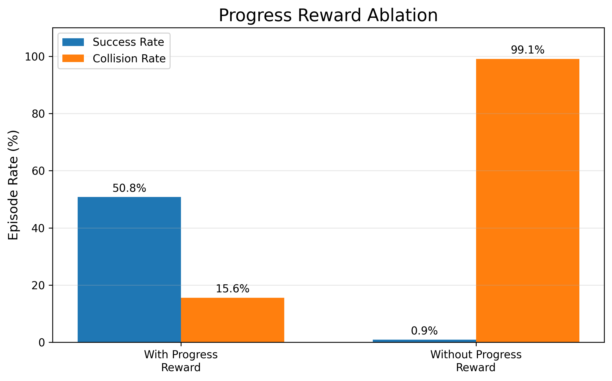
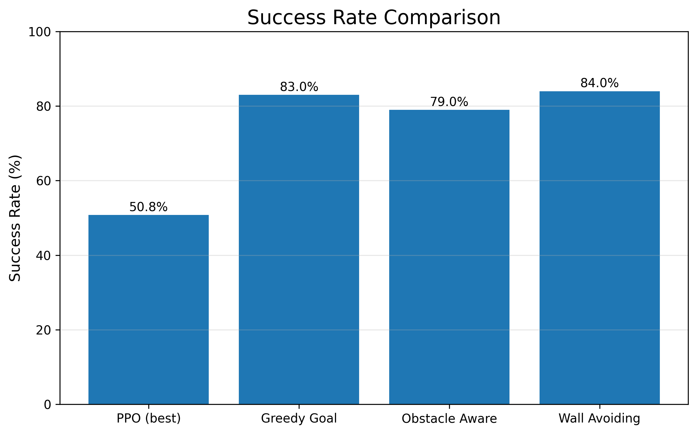
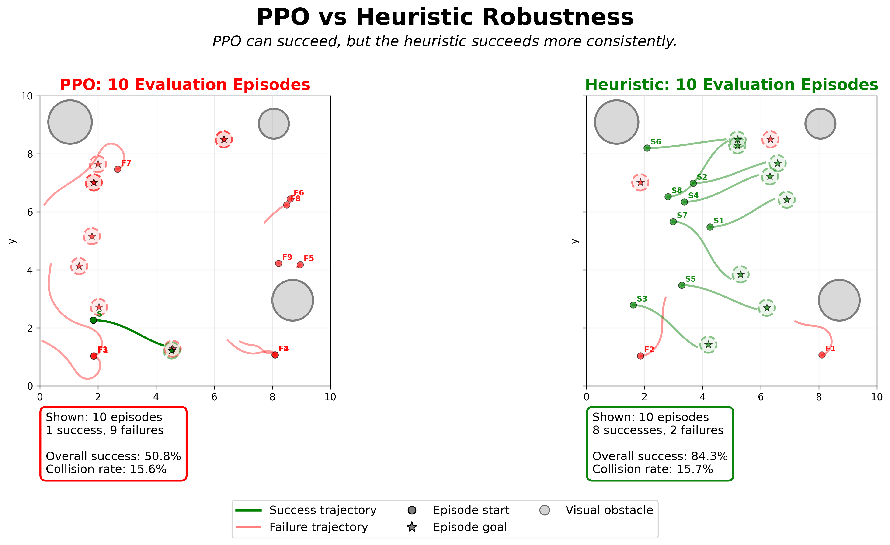

# PPO Drone Navigation: Why Better RL Still Lost to Simple Rules

A reproducible reinforcement-learning study on autonomous navigation in a custom 2D Gymnasium environment.

This project investigates how reward design, termination logic, observation complexity, and baseline selection affect a PPO agent trained to reach a goal while avoiding obstacles.

The best PPO configuration improved success from **35.1% to 50.8%**, but a simple wall-avoiding greedy heuristic reached **84.3%**.

> The central result is not that PPO failed. Rather, reward redesign and sensor simplification substantially improved PPO, while strong hand-written baselines still came out on top.

<p align="center">
  
</p>

## Key results

Deterministic evaluation used 300 episodes per training seed after 800,000 PPO timesteps per configuration.

| Configuration | Success | Collision | Timeout | Stuck | Path efficiency |
|---|---:|---:|---:|---:|---:|
| Baseline PPO, 16 lidar rays | 35.1% | 7.7% | 48.2% | 8.9% | 0.274 |
| Reward/termination redesign, 16 rays | 44.2% | 14.3% | 7.2% | 34.2% | 0.322 |
| Best PPO, 8 rays | **50.8%** | 15.6% | 7.2% | 26.4% | **0.381** |
| Wall-avoiding greedy heuristic | **84.3%** | 15.7% | 0.0% | — | **0.780** |

The reward redesign reduced timeout-heavy behavior, but it did not eliminate failure. It shifted failures toward stuck terminations and collisions.

<p align="center">
  
</p>

## Research questions

This repository studies four questions:

1. Can reward and termination redesign reduce PPO hesitation and timeout failures?
2. Does increasing lidar resolution improve navigation under a fixed training budget?
3. How dependent is the learned policy on dense progress reward?
4. Can PPO outperform simple non-learning navigation heuristics?

## Environment

The task is a custom 2D drone-navigation environment implemented with Gymnasium.

The observation contains:

- relative goal position
- normalized velocity
- heading represented as cosine and sine
- lidar-style ray measurements

The action contains:

| Action | Meaning |
|---|---|
| Target heading | Absolute heading in radians |
| Target speed | Desired forward speed |

Low-level motion is handled by bounded PD-style dynamics. The policy therefore learns target direction and speed rather than raw motor commands.

## Reward and termination redesign

The original hard configuration allowed the policy to survive for a long time without solving the task. The redesigned setup introduced stronger pressure against passive behavior through:

- timeout penalties
- stall and low-speed penalties
- stuck detection
- shorter episodes
- stricter termination logic

The redesign increased success from **35.1% to 44.2%** and reduced timeouts from **48.2% to 7.2%**. However, stuck and collision failures increased.

This is an important distinction: the redesign improved task completion, but it also changed how the policy failed.

## Sensor-resolution ablation

The lidar experiment kept the PPO architecture, training budget, reward design, and environment settings fixed. Only the number of lidar rays changed.

| Lidar rays | Approx. observation dimension | Success | Collision | Timeout | Stuck | Path efficiency |
|---:|---:|---:|---:|---:|---:|---:|
| 8 | 14 | **50.8%** | 15.6% | 7.2% | 26.4% | **0.381** |
| 16 | 22 | 44.2% | 14.3% | 7.2% | 34.2% | 0.322 |
| 32 | 38 | 36.0% | 17.2% | 9.0% | 37.8% | 0.276 |

More sensor information did not improve PPO under the fixed setup. The 8-ray policy performed best, while the 32-ray policy performed worst.

This result should not be interpreted as evidence that higher-resolution perception is generally harmful. It shows that additional observation dimensionality can make optimization harder when the policy architecture and training budget remain fixed.

<p align="center">
  
</p>

## Progress-reward ablation

To measure how strongly PPO depended on dense shaping, the progress reward was removed while keeping the rest of the best 8-ray setup unchanged.

| Configuration | Success | Collision | Timeout | Stuck |
|---|---:|---:|---:|---:|
| Best PPO setup | 50.8% | 15.6% | 7.2% | 26.4% |
| No progress reward | **0.9%** | **99.1%** | 0.0% | 0.0% |

The result indicates that progress reward was not merely accelerating training. It provided a critical optimization signal without which PPO failed to discover a viable navigation strategy.

<p align="center">
  
</p>

## PPO versus heuristic baselines

The final comparison included four non-learning policies:

- random policy
- greedy goal-following policy
- obstacle-aware heuristic
- wall-avoiding greedy heuristic

| Policy | Success | Collision | Timeout | Path efficiency |
|---|---:|---:|---:|---:|
| Random | 6.3% | 75.7% | 18.0% | 0.030 |
| PPO best | 50.8% | 15.6% | 7.2% | 0.381 |
| Greedy goal | 83.3% | 16.7% | 0.0% | 0.770 |
| Obstacle-aware | 79.0% | 0.3% | 20.7% | 0.560 |
| Wall-avoiding greedy | **84.3%** | 15.7% | 0.0% | **0.780** |

The best heuristic outperformed PPO by 33.5 percentage points. This changed the interpretation of the project: PPO improved substantially, but it did not solve the task competitively.

<p align="center">
  
</p>

<p align="center">
  
</p>

## Repository structure

```text
ppo-drone-navigation/
├── env/
│   ├── __init__.py
│   ├── drone_env.py
│   ├── dynamics.py
│   ├── geometry.py
│   ├── obstacles.py
│   ├── reward.py
│   ├── sampling.py
│   └── sensors.py
│
├── baselines/
│   ├── __init__.py
│   ├── base.py
│   ├── random_policy.py
│   ├── greedy_goal.py
│   ├── obstacle_aware.py
│   └── wall_avoiding.py
│
├── experiments/
│   ├── __init__.py
│   ├── train_ppo.py
│   ├── evaluate.py
│   ├── evaluate_baselines.py
│   ├── run_ablation_matrix.py
│   ├── train_curriculum.py
│   ├── evaluate_curriculum.py
│   ├── benchmark.py
│   └── asset_pipeline.py
│
├── configs/
│   ├── environment/
│   │   ├── easy.yaml
│   │   ├── medium.yaml
│   │   └── hard.yaml
│   └── ablations/
│       ├── reward_redesign.yaml
│       ├── lidar_8.yaml
│       ├── lidar_16.yaml
│       ├── lidar_32.yaml
│       └── no_progress_reward.yaml
│
├── scripts/
├── tests/
├── assets/
├── docs/
│   └── experiment_matrix.md
├── .gitignore
├── pytest.ini
├── LICENSE
├── README.md
└── requirements.txt
```

## Installation

Recommended environment:

- Python 3.11
- Windows PowerShell, Linux, or macOS terminal

### Windows PowerShell

```powershell
python -m venv .venv
.\.venv\Scripts\Activate.ps1
python -m pip install --upgrade pip
python -m pip install -r requirements.txt
```

### Linux or macOS

```bash
python3 -m venv .venv
source .venv/bin/activate
python -m pip install --upgrade pip
python -m pip install -r requirements.txt
```

## Run the test suite

```powershell
python -m pytest -q
```

The repository should complete the environment, reward, geometry, sensor, robustness, integration, and baseline tests without failures.

## Train PPO

Example 8-ray training run:

```powershell
python experiments\train_ppo.py `
  --config configs\ablations\lidar_8.yaml `
  --timesteps 800000 `
  --seed 42 `
  --run-name hard_reward_redesign_8r_seed42
```

Repeat the experiment for the reported training seeds:

```text
42, 123, 999
```

Use a separate output directory or run name for every configuration and seed.

## Evaluate a trained PPO model

```powershell
python experiments\evaluate.py `
  --config configs\ablations\lidar_8.yaml `
  --model results\models\hard_reward_redesign_8r_seed42\final_model.zip `
  --vecnorm results\vecnormalize\hard_reward_redesign_8r_seed42\vecnormalize.pkl `
  --episodes 300 `
  --seed 42 `
  --deterministic `
  --plot-trajectory
```

The model and `VecNormalize` statistics must come from the same training run.

## Evaluate heuristic baselines

```powershell
python experiments\evaluate_baselines.py `
  --config configs\ablations\lidar_8.yaml `
  --episodes 300 `
  --seed 42 `
  --policies random greedy_goal obstacle_aware wall_avoiding_greedy `
  --output-dir results\baselines\lidar_8
```

The baseline evaluator writes episode-level CSV files, step-level telemetry, summary tables, and comparison plots.

## Reproducibility

The main experiments use:

| Setting | Value |
|---|---|
| Algorithm | PPO |
| Training budget | 800,000 timesteps |
| Parallel environments | 4 |
| Training seeds | 42, 123, 999 |
| Evaluation episodes | 300 per seed |
| Evaluation mode | Deterministic |
| Main metrics | Success, collision, timeout, stuck, path efficiency |

For each run, preserve:

- the exact YAML configuration
- training seed
- model checkpoint
- `VecNormalize` statistics
- evaluation CSV files
- package versions

The experiment definitions are summarized in [`docs/experiment_matrix.md`](docs/experiment_matrix.md).

## Earlier project phase

The first phase of the project studied performance degradation across easy, medium, and hard environments. Those experiments motivated the later reward, sensor-resolution, and baseline studies.

They are retained as historical context, but they are not the primary result of the current repository.

## Limitations

- The environment is a custom 2D simulation, not a real flight system.
- The training budget, network architecture, and PPO hyperparameters were fixed during the main ablations.
- The results do not show that PPO cannot solve the task under a different setup.
- The heuristic policies use hand-designed structure tailored to this environment.
- Higher-capacity networks, recurrent policies, longer training, alternative algorithms, or global planning may change the ranking.
- Reward and termination choices remain part of the task definition and strongly influence the observed failure modes.

## Main takeaway

Reward redesign improved PPO. Sensor simplification improved it further. Progress-reward ablation exposed strong dependence on dense shaping.

But the most important result came from the baselines:

> The agent improved, but it did not win.

Strong baselines turned a reward-tuning exercise into a more credible investigation of learning behavior.

## Related article

This repository supports the article:

**“I Improved My PPO Agent by 45%. It Still Lost to Simple Rules.”**

## License

This project is licensed under the MIT License. See [`LICENSE`](LICENSE) for details.
